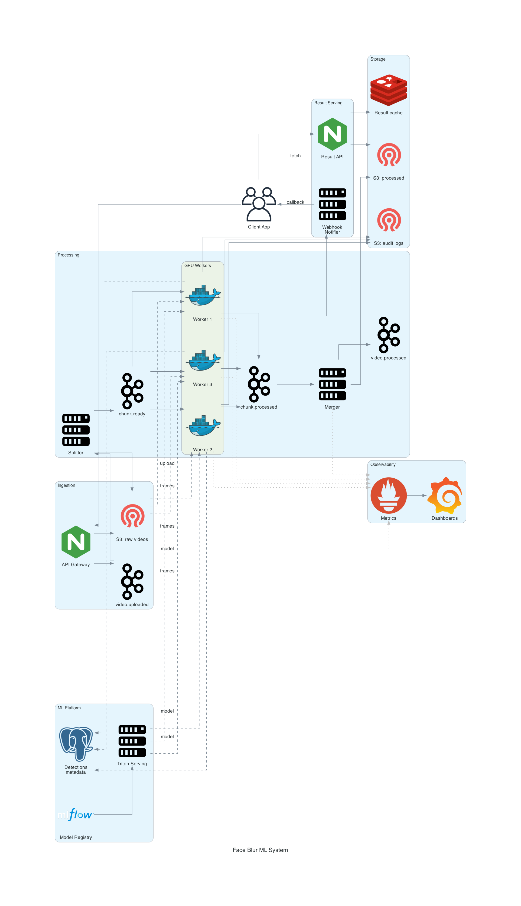

# Архитектура ML-системы для блюра лиц на видео

## Бизнес-контекст

КоАП РФ ст. 13.11.3 устанавливает ответственность за непринятие мер по защите биометрических персональных данных: до 500 тыс. руб. для должностных лиц и до 1.5 млн руб. для юрлиц. Лица в видеозаписях клиентов попадают под это определение, поэтому система должна гарантированно удалять биометрию до того, как видео попадёт в долговременное хранилище или к третьим лицам.

## Анализ исходного кода

Референсный код из ноутбука выполняет следующее: загружает Haar cascade `haarcascade_frontalface_default.xml`, открывает видео через `cv2.VideoCapture`, покадрово конвертирует в grayscale, детектирует лица через `detectMultiScale`, применяет мозаичный эффект (downscale + upscale через `cv2.INTER_NEAREST`), пишет результат в выходное видео через `cv2.VideoWriter`.

Ограничения референсного кода:
- **Синхронный однопоточный pipeline** - кадры обрабатываются последовательно, GPU и многоядерный CPU простаивают
- **Монолитная функция** - детекция, блюр и I/O смешаны в одном цикле
- **Нет масштабируемости** - обработка часового видео в HD занимает порядка часа
- **Нет отказоустойчивости** - падение в середине файла приводит к потере всего прогресса
- **Нет аудита** - невозможно доказать, что блюр применён ко всем кадрам
- **Haar cascade неточен** - пропускает лица в профиль, под наклоном, частично закрытые. В продакшене требуется CNN-детектор (RetinaFace, YOLO-face, MTCNN)

## Стратегия параллелизма

Видео - это естественно параллелизуемая структура: кадры независимы друг от друга на этапе детекции и блюра (зависимость только при финальной сборке для сохранения порядка). Возможны три уровня параллелизма:

1. **Параллелизм по видео** - несколько видео обрабатываются одновременно разными воркерами (горизонтальное масштабирование).
2. **Параллелизм по чанкам** - одно видео разбивается на N сегментов, каждый обрабатывается отдельно, затем склеивается.
3. **Батчинг кадров на GPU** - внутри одного воркера несколько кадров пропускаются через детектор одной матричной операцией.

В продакшене разумно применять все три одновременно.

## Архитектура системы

### Слой 1. Ingestion

- **API Gateway** - REST/gRPC endpoint для загрузки видео, аутентификация, rate limiting
- **Object Storage (raw)** - S3/MinIO bucket с исходными видео, шифрование at-rest, retention policy
- **Message Queue** - Kafka/RabbitMQ, в очередь публикуется событие `video.uploaded` с metadata (id, размер, продолжительность, source)

### Слой 2. Processing

- **Splitter Service** - потребляет `video.uploaded`, разбивает видео на чанки фиксированной длины (например, 30 секунд), публикует события `chunk.ready` с указанием диапазона кадров и ссылки на исходник
- **Worker Pool** (N инстансов на Kubernetes) - каждый воркер потребляет `chunk.ready`:
  - Загружает свой диапазон кадров из object storage
  - Прогоняет батчем через face detection model на GPU (TensorRT/ONNX Runtime)
  - Применяет блюр к bounding box
  - Кодирует обработанный чанк, кладёт в `processed-chunks/` bucket
  - Публикует `chunk.processed`
- **Merger Service** - собирает чанки одного видео, склеивает в финальный файл, проверяет порядок и целостность через checksum, публикует `video.processed`

### Слой 3. Model

- **Model Registry** (MLflow) - хранит версии детектора лиц с метриками (recall на тест-сете, latency)
- **Model Serving** - детектор упакован в Triton/TorchServe, воркеры обращаются по gRPC, либо детектор загружается локально для минимизации сетевых hop'ов
- **Feature/Metadata Store** - в DVC хранятся версии cascade XML или весов модели, в Postgres - таблица `detections` с координатами найденных лиц для аудита

### Слой 4. Storage

- **Raw bucket** - исходное видео, доступ только сервисов ingestion и splitter, retention 7 дней с момента обработки
- **Processed bucket** - выходное видео без биометрии, отдаётся клиенту
- **Audit bucket** - JSON-логи детекций (frame, bbox, confidence) для каждого видео, нужны для доказательства соответствия 152-ФЗ и КоАП

### Слой 5. Serving

- **Result API** - REST endpoint, отдаёт ссылку на обработанное видео по `video_id`, генерирует presigned URL с TTL
- **Webhook Notifier** - при `video.processed` отправляет callback клиентскому сервису

### Слой 6. Monitoring и Observability

- **Метрики (Prometheus)**:
  - Бизнес: процент обработанных видео без ошибок, среднее время обработки на минуту видео
  - Модель: распределение confidence детекций, средняя площадь bounding box (drift signal)
  - Инфраструктура: GPU utilization, queue depth, worker CPU/memory
- **Логи** (Loki/ELK) - структурированные JSON-логи всех сервисов
- **Трейсинг** (OpenTelemetry) - end-to-end span от загрузки до выдачи результата
- **Alerting** - алерт на падение recall (через периодический прогон на эталонном сете), на рост latency, на дисбаланс очереди
- **Data Quality** - регулярная проверка sample'ов обработанных видео человеком (или на синтетике) - действительно ли все лица заблюрены

## Схема архитектуры

Схема сгенерирована через библиотеку [Diagrams](https://diagrams.mingrammer.com), исходник — [face_blur_diagram.py](face_blur_diagram.py). Mermaid-версия диаграммы приведена ниже в разделе «Mermaid-диаграмма».

## Сравнение с референсным кодом

| Аспект                 | Референс (ноутбук)        | Продакшен-архитектура                          |
| ---------------------- | ------------------------- | ---------------------------------------------- |
| Параллелизм            | Однопоточный              | Горизонтальное масштабирование воркеров        |
| Детектор               | Haar cascade (CPU)        | CNN на GPU (RetinaFace/YOLO-face), батчинг     |
| Хранилище              | Локальный файл            | S3 с версионированием, шифрованием, retention  |
| Отказоустойчивость     | Падение = потеря всего    | Чанки переобрабатываются, idempotency через id |
| Аудит                  | Нет                       | JSON-логи детекций, retention для регуляторов  |
| Версионирование модели | Файл `.xml` рядом с кодом | MLflow Registry, A/B тестирование версий       |
| Мониторинг качества    | Нет                       | Periodic recall check, drift detection         |
| SLA                    | Не определён              | Time-to-process < N минут на минуту видео      |

## Что необходимо обязательно (требование закона)

- Audit log с координатами и confidence каждой детекции - для доказательства должной осмотрительности
- Шифрование raw bucket at-rest и in-transit
- Retention policy на raw - удаление через X дней после обработки
- Регулярные регрессионные прогоны на эталонном датасете для контроля recall детектора